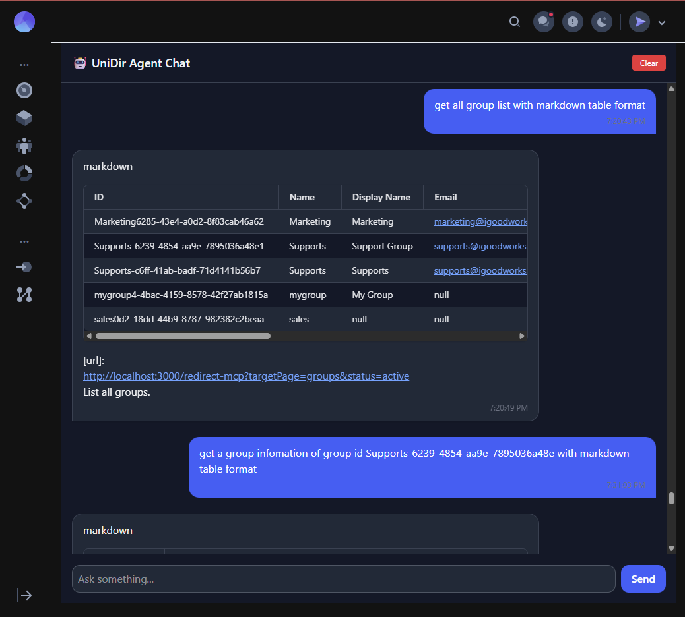
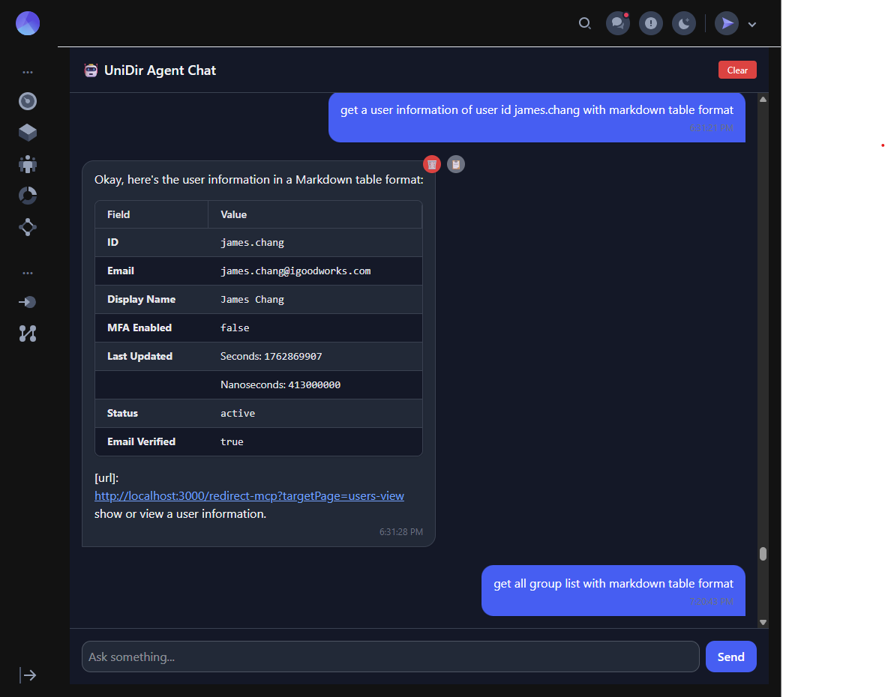

# 🧠 AI Agentic Universal Directory (UniDir)

**AI Agentic Universal Directory** — also known as **UniDir** — is an advanced **OAuth2 Authorization Server** and **AI-powered Agent Platform** that unifies traditional identity management and modern AI interaction.

It supports **all standard OAuth 2.0 and OpenID Connect flows**, **Machine-to-Machine (M2M)** authentication, **Token Exchange (RFC 8693)**, and **MCP (Model Context Protocol)** integration for AI Agents that can reason about and retrieve directory information in natural language.

---

## 🚀 Key Features

- ✅ **Full OAuth 2.0 & OIDC compliance**

  - Authorization Code Grant (+PKCE)
  - Client Credentials
  - Refresh Token
  - Resource Owner Password Credentials (legacy) (Working....)
  - Device Authorization Grant (Working....)
  - Token Exchange (RFC 8693) (Working....)

  | Grant Type                              | Description                                                   | Endpoint Example                                |
  | --------------------------------------- | ------------------------------------------------------------- | ----------------------------------------------- |
  | **Authorization Code**                  | Used by web apps (confidential clients). Supports PKCE.       | `/oauth2/authorize`, `/oauth2/token`            |
  | **Client Credentials**                  | For machine-to-machine (M2M) or backend service auth.         | `/oauth2/token`                                 |
  | **Resource Owner Password Credentials** | Legacy mode for trusted first-party clients.                  | `/oauth2/token`                                 |
  | **Device Authorization**                | For TV/CLI devices with no browser.                           | `/oauth2/device_authorization`, `/oauth2/token` |
  | **Refresh Token**                       | Obtain new access tokens without user re-login.               | `/oauth2/token`                                 |
  | **Token Exchange (RFC 8693)**           | Exchange one token for another (impersonation or delegation). | `/oauth2/token`                                 |

| Endpoint                   | Purpose                                     |
| -------------------------- | ------------------------------------------- |
| `/oauth2/authorize`        | Start authorization (browser redirect flow) |
| `/oauth2/token`            | Issue tokens for all grant types            |
| `/oauth2/introspect`       | Validate token metadata                     |
| `/oauth2/revoke`           | Revoke tokens (to be added)                 |
| `/oauth2/jwks.json`        | Public signing keys                         |
| `/t/:tenantId/scim/v2/...` | Directory endpoints                         |

flowchart TD
A[User / AI Client] -->|OAuth2 + MCP| B[UniDir OAuth Server]
B --> C[SCIM Directory API]
B --> D[Token Service / JWKS]
B --> E[AI Agent Runtime]
E --> F[External APIs / Knowledge / Identity Providers]

| Variable             | Description                                      |
| -------------------- | ------------------------------------------------ |
| `UNIDIR_BASE_URL`    | Base URL of OAuth2 server                        |
| `UNIDIR_JWKS_PATH`   | Path for JWKS file                               |
| `UNIDIR_ISSUER`      | Issuer name for tokens                           |
| `UNIDIR_DB_URL`      | Database connection string                       |
| `UNIDIR_MCP_ENABLED` | `true` to enable Agentic query endpoint          |
| `UNIDIR_AI_MODEL`    | Default model (e.g., `gpt-4o`, `gemini-1.5-pro`) |

- 🧩 **Multi-tenant support**
  - Tenant-scoped endpoints
  - Segregated OUs and email domain scoping
- 🔐 **Advanced Token Management**
  - JWT or opaque tokens
  - Rotating signing keys (JWKS endpoint)
  - Introspection and revocation endpoints
- ⚙️ **SCIM 2.0 Integration**
  - `/scim/v2/Users`, `/scim/v2/Groups`, and enterprise extensions
- 🤖 **AI Agentic Extension**

  - Built-in **MCP (Model Context Protocol)** adapter for connecting LLM-based agents
  - Agents can query or mutate directory data conversationally
  - Example: _“List all active users in iGoodWorks tenant”_ → structured API response
  - 
  - 

- 🧱 **Extensible via Plugins**
  - AI Agent Plugins (TypeScript or Python)
  - External IDP integrations (Azure AD, Okta, Google Workspace) -->

---

## 🧠 What Is “Agentic” in UniDir?

An **Agentic Directory** means the directory itself can be _queried, reasoned about, and acted upon_ by AI agents using structured tools (OAuth + MCP).

**Example:**

User: "Show me all users with table format."
Agent → UniDir:

| ID                                   | Username               | Display Name | Email                      | Status | MFA   |
| ------------------------------------ | ---------------------- | ------------ | -------------------------- | ------ | ----- |
| guest01@igoodworks.comc-94ea43eae45a | guest01@igoodworks.com | Guest01      | guest01@igoodworks.com     | new    | false |
| james.chang                          | james.chang            | James Chang  | james.chang@igoodworks.com | active | false |
| peter.kim0ee2-4981-b70b-57b412480bc2 | peter.kim              | Peter Kim    | peter.kim@igoodworks.dom   | new    |       |
| test01@ashurst.com-8b42-97af38ec69a4 | test01@ashurst.com     | Hellotest01  | test01@ashurst.com         | new    | true  |

- url: http://oauth.biocloud.pro/v1/redirect-mcp?targetPage=users
- List all users.

## Grant Type flow

- **Token Exchange**
  | Scenario | Example |
  | -------------------------------- | ------------------------------------------------------------------------------------------------ |
  | **Backend API → Downstream API** | API A receives a user’s access_token and exchanges it for an access token scoped only for API B. |
  | **Impersonation (Act-as)** | Admin app exchanges a token to act-as a user. |
  | **Delegation** | Mobile app exchanges user token into a reduced-scope backend token. |
  | \*\*JWT → Access Token\*\* | Exchange a third-party JWT into your own OAuth2 access_token. |

- **Realistic JSON Example (Request & Response)**

```
Request

POST /oauth2/token
Content-Type: application/x-www-form-urlencoded

grant_type=urn:ietf:params:oauth:grant-type:token-exchange
subject_token=eyJhbGciOi...
subject_token_type=urn:ietf:params:oauth:token-type:access_token
requested_token_type=urn:ietf:params:oauth:token-type:access_token
audience=api://service-b
scope=read:items
```

```
Response

{
  "access_token": "eyJhbGciOi...",
  "issued_token_type": "urn:ietf:params:oauth:token-type:access_token",
  "token_type": "Bearer",
  "expires_in": 3600,
  "scope": "read:items"
}
```
